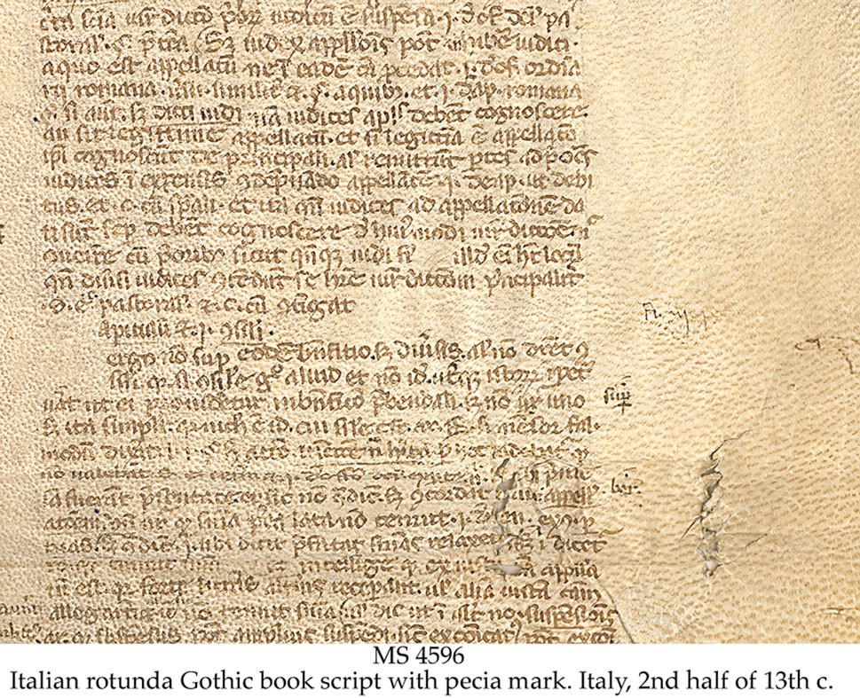
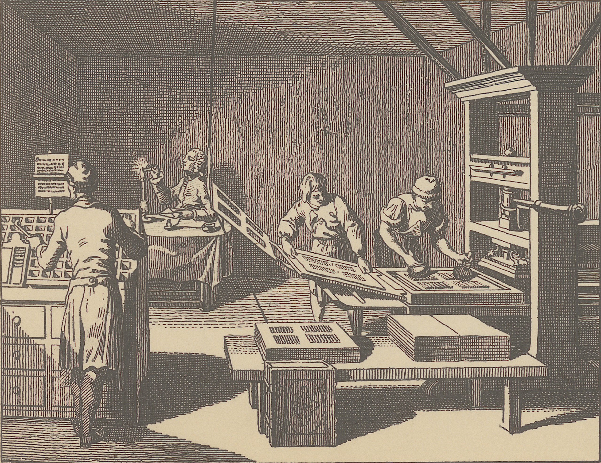
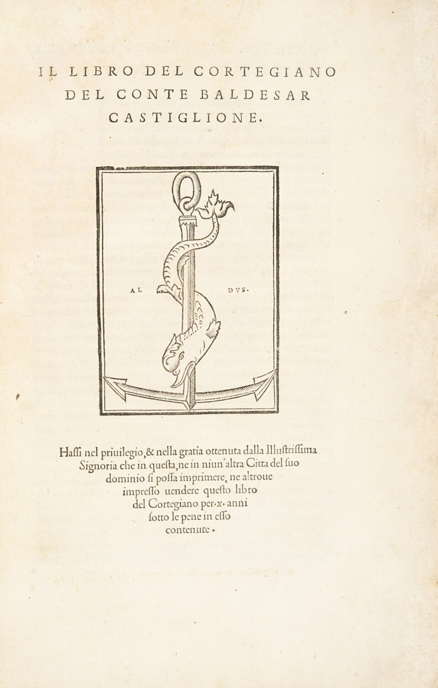

## Plan de la séance
 
 

- Définition d'édition
- Édition
- Un peu d'histoire
- Quelle est la fonction de l'édition?

# Définition d'édition

## Définition d'édition

> 1. Action d’établir un texte sur le plan scientifique, en vue de le publier (édition scientifique). 
> 2. Par ext., action de reproduire ce texte sous forme d’imprimé. 
> 3. Par métonymie, ensemble des exemplaires d’un texte imprimé comme un tout et en une seule fois (première édition, etc.). 
> 4. Branche d’activité (dans des formules comme « la crise de l’édition »). (Barbier, p. 338)

## Définition d'édition

> Dans son acception bibliographique, édition désigne l’ensemble des exemplaires imprimés à partir d’une même composition et destinés à être diffusés simultanément. Si le texte est modifié en cours de composition, on se trouve devant une variante éditoriale. Si la composition a été conservée, par ex. sous forme de plaques stéréotypiques, et que l’on imprime de nouveaux exemplaires, on parle d’impression ou de réimpression (le commerce de librairie désigne cependant aussi comme édition une réimpression des mêmes formes). (_idem_)

## Définition d'édition

_editio_, _editionis_

1. MÉDECINE accouchement
2. publication d'un livre, édition
3. nouvelle, version d'un fait
4. DROIT déclaration, exposition de l'action judiciaire
5. préparation des jeux, représentation d'un spectacle

([Grand Dictionnaire Latin](https://www.grand-dictionnaire-latin.com/dictionnaire-latin-francais.php?parola=editio))

Lat. _editor_, de _edere_, faire sortir, mettre dehors ; de _e_, et _dere_ pour _dare_, donner. ([Dictionnaire Littré](https://www.littre.org/definition/%C3%A9diteur))

# Édition

## Édition
 
 

- variante éditoriale: modifications en cours de composition
 
 

- impression ou réimpression: conservation de la composition et nouvelles impressions, 
  + ex. sous forme de plaques stéréotypiques 
 
 

- édition philologique

# Un peu d'histoire

## Un peu d'histoire: le manuscrit et l'université

::::{.columns}

:::{.column}

:::

:::{.column}

- des libraires laïcs (_librarii_) ou « stationnaires » (_stationarii_, du latin médiéval _statio_, « boutique » et/ou « atelier »)
- l'exemplaire (_exemplar_) de l'université donne vie aux _paciae_ des cahiers, des fasciucules manuscrits
 

Pas de droits d'auteur, mécénat ou protecteur royal ou aristocratique

:::

::::

## Un peu d'histoire: naissance de l'imprimerie

::::{.columns}

:::{.column}

1450 Gutenberg et l'impression à caractères mobiles (_Bible_)

- imprimeur-libraire
  + technique: de la composition à l'impression
  + choix éditoriaux
  + commerce

:::

:::{.column}

:::

::::

## Un peu d'histoire: naissance de l'imprimerie

::::{.columns}

:::{.column}

:::

:::{.column}

imprimeurs-humanistes

- Aldo Manuzio, Venice, édition de poche in-8°
- Sébastien Gryphe, Lyon, cercle d'écrivains et correcteurs (Rabelais)

+ purs éditeurs déjà à partir du XVe siècle, Antoine Vérard, Paris
+ séparation de l'espace typographique imprimeur et éditeur

:::

::::

## Un peu d'histoire: les contrefaçons et les droits d'auteur

- censure et monopole
- philosophe comme Rousseau (Marc-Michel Rey, Amsterdam) ou Voltaire (frères Cramer, Genève)

## (Édition et contrefaçons)

| | | |
|---|---|---|
| <iframe src="https://gallica.bnf.fr/ark:/12148/bpt6k1280249s/f11.item.r=Horace%20Pierre%20Corneille" title="description_of_embedded_content" style="height:550px;"></iframe> | <iframe src="https://gallica.bnf.fr/ark:/12148/bpt6k1280244q/f11.item.r=Horace%20Pierre%20Corneille" title="description_of_embedded_content" style="height:550px;"></iframe> | <iframe src="https://gallica.bnf.fr/ark:/12148/bpt6k1510050j/f3.item.r=Horace%20Pierre%20Corneille" title="description_of_embedded_content" style="height:550px;"></iframe> |

## (Édition et contrefaçons)

Corneille, Pierre <i>Horace</i>, 1641, BNF, département Arsenal, RESERVE 4-BL-3515. <a href="https://gallica.bnf.fr/ark:/12148/bpt6k1280249s/f11.item.r=Horace%20Pierre%20Corneille">Accès en ligne</a>.
<ul>
<li>Format: in-12°</li>
<li>Décoration moyenne</li>
</ul>

<iframe src="https://gallica.bnf.fr/ark:/12148/bpt6k1280249s/f11.item.r=Horace%20Pierre%20Corneille" title="description_of_embedded_content" style="display: inline; height:550px; width: 450px;"></iframe>

## (Édition et contrefaçons)

Corneille, Pierre <i>Horace</i>, 1641, BNF, département Arsenal, RESERVE 4-BL-3515. <a href="https://gallica.bnf.fr/ark:/12148/bpt6k1280244q/f11.item.r=Horace%20Pierre%20Corneille">Accès en ligne</a>.
<ul>
<li>Format: in-8°</li>
<li>Décoration pauvre</li>
</ul>

<iframe src="https://gallica.bnf.fr/ark:/12148/bpt6k1280244q/f11.item.r=Horace%20Pierre%20Corneille" title="description_of_embedded_content" style="display: inline; height:550px; width: 450px;">
</iframe>

## (Édition et contrefaçons)

Corneille, Pierre <i>Horace</i>, 1641, BNF, département Arsenal, RESERVE 4-BL-3515. <a href="https://gallica.bnf.fr/ark:/12148/bpt6k1510050j/f3.item.r=Horace%20Pierre%20Corneille">Accès en ligne</a>.
<ul>
<li>Format: in-4°</li>
<li>Décoration riche</li>
</ul>

<iframe src="https://gallica.bnf.fr/ark:/12148/bpt6k1510050j/f3.item.r=Horace%20Pierre%20Corneille" title="description_of_embedded_content" style="display: inline; height:550px; width: 450px;"></iframe>

## Un peu d'histoire: les contrefaçons et les droits d'auteur

- censure et monopole
- philosophe comme Rousseau (Marc-Michel Rey, Amsterdam) ou Voltaire (frères Cramer, Genève)
- En Angleterre
  + _Licensing Act_ (1695) et _Copyright Act_ (1710)
  + _congers_ association d'éditeurs
- En France
  + 1793 decret droit d'auteur avec protection 10 après la mort

## Un peu d'histoire: l'industrialisation
 
 

- séparation éditeur et imprimeur
- naissance des grandes Maison d'édition comme Hachette (1826), Larousse (1852) et Flammarion (1876)
- Gervais Charpentier, « Bibliothèque Charpentier » (1838), 3.50 francs
- Michel Lévy, « Collection Michel Lévy » (1856), 1 franc

# Quelle est la fonction de l'édition?

## Quelle est la fonction de l'édition?
 
 

Le rôle de l’éditeur est fondamental et il faut consiérer, notamment à l'ère du numérique que 
 
 

> Ambassadeur culturel et intellectuel, intermédiaire essentiel entre l’auteur et le lecteur (Poirier et Genêt, p. 17)

## Quelle est la fonction de l'édition?

> Un commerçant ou un homme d’affaires ne devient éditeur qu’à partir du moment où il prend sur lui la (double) responsabilité matérielle et morale d’une œuvre. (Poirier et Genêt, p. 18)
 

## Quelle est la fonction de l'édition?

> Un commerçant ou un homme d’affaires ne devient éditeur qu’à partir du moment où il prend sur lui la (double) responsabilité matérielle et morale d’une œuvre. (Poirier et Genêt, p. 18)
 

Rôle: éditeur et entrepreneur
 

André Grasset entre-deux: homme de lettres et entrepreneur/marchand (Pierre Bordieu aussi)

## Quelle est la fonction de l'édition? Constituer un catalogue

> **médiateur** indispensable entre une **œuvre** et un **marché**, dans l’espoir de répondre aux désirs, aux attentes et aux **goûts du public**.
> 
> En ce sens, le catalogue d’un éditeur, c’est-à-dire l’ensemble des auteurs et des titres que chapeaute la maison d’édition, se veut en quelque sorte le reflet de cette coexistence antagoniste entre des valeurs économiques et culturelles, en plus de témoigner du parcours intellectuel, de la personnalité et, bien sûr, des intérêts de l’éditeur, qu’ils soient artistiques, techniques, économiques ou littéraires.(Poirier et Genêt, p. 20)

Le «tri» est fait par l'éditeur ou un comité externe.

## Quelle est la fonction de l'édition? Mettre en forme

Directeur de collection | éditeur

- Accompagnement aux éditeurs pour la construction de l'ouvrage à publier. 
- Revision et correction, on parle d'«artisans» du livre*
- Traducteurs*

(*) parfois des externes

## Quelle est la fonction de l'édition? Fabriquer le livre

Étapes souvent en parallèle

- infographiste
- correcteur.trice
- imprimeur -> il établit les coûts
  + numéros de pages
  + présence d'images
  + couverture
  + type de papier

## Quelle est la fonction de l'édition? Diffusion et distribution

> promotion de valeurs littéraires, à la légitimation d’une vision esthétique, d’un mouvement artistique ou d’un courant de pensée. […] il remplit par là un rôle social en assurant le développement et la pérennité de la vie intellectuelle, littéraire ou, plus largement, culturelle de la société. (Poirier et Genêt, p. 23)

Le numérique aide les éditeur.trice.s à se reapproprier de l'aspect commercial, publicitaire et divulgatoire, qui est delegué à des entreprises privés. 

## Références

- Barbier, Frédéric, _Histoire des bibliothèques: d’Alexandrie aux bibliothèques virtuelles, Deuxième édition revue et augmentée_, Malakoff, Armand Colin, 2016.
- Febvre, Lucien et Henri-Jean Martin, _L’apparition du livre_, Chicoutimi, J.-M. Tremblay, 2008.
- Poirier, Patrick et Pascal Genêt, « La fonction éditoriale et ses défis », dans Vitali Rosati, Marcello et Michaël Eberle Sinatra, _Pratiques de l’édition numérique_, Montréal, Presses de l’Université de Montréal, 2014, p. 15‑29.
- Sordet, Yann et Robert Darnton, _Histoire du livre et de l’édition: production & circulation, formes & mutations_, Paris, Albin Michel, 2021.

## Images

- Andrea e Gian Francesco Torresani, _edição princeps de 1528_, [en ligne](https://commons.wikimedia.org/wiki/File:Baldassare_Castiglione_Il_libro_del_cortegiano_1528.jpg)
- Ensahequ, _Caratteri mobili del Museo della stampa Lodovico Pavoni_, [en ligne](https://commons.wikimedia.org/wiki/File:Caratteri_mobili_del_Museo_della_stampa_Lodovico_Pavoni.jpg)
- Leah Henrickson, _pecia mark_, [en ligne](https://bhilluminated.wordpress.com/2013/06/06/the-pecia-system/)
- Daniel Nikolaus Chodowiecki, _Tab. XXI c. Die Buchdruckerei_, National Library of Poland, [en ligne](https://commons.wikimedia.org/w/index.php?curid=180715172)

